# Confidential Asset Workflows

This document provides detailed flowcharts and sequence diagrams for all confidential asset operations in the Polymesh Confidential Assets UI.

## Table of Contents

- [Onboarding Flow](#onboarding-flow)
- [Confidential Account Management](#confidential-account-management)
- [Asset Management](#asset-management)
- [Settlement Workflows](#settlement-workflows)

---

## Onboarding Flow

New users must complete wallet connection and identity setup before using the application.

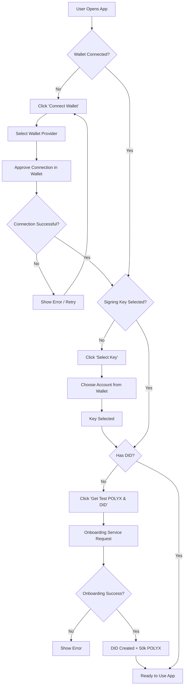
```mermaid
flowchart TD
    A[User Opens App] --> B{Wallet Connected?}
    B -->|No| C[Click 'Connect Wallet']
    C --> D[Select Wallet Provider]
    D --> E[Approve Connection in Wallet]
    E --> F{Connection Successful?}
    F -->|No| G[Show Error / Retry]
    G --> C
    F -->|Yes| H{Signing Key Selected?}
    B -->|Yes| H

    H -->|No| I[Click 'Select Key']
    I --> J[Choose Account from Wallet]
    J --> K[Key Selected]
    K --> L{Has DID?}
    H -->|Yes| L

    L -->|No| M[Click 'Get Test POLYX & DID']
    M --> N[Onboarding Service Request]
    N --> O{Onboarding Success?}
    O -->|No| P[Show Error]
    O -->|Yes| Q[DID Created + 50k POLYX]
    Q --> R[Ready to Use App]
    L -->|Yes| R
```

---

## Confidential Account Management

Confidential accounts consist of two cryptographic keys:

- **Account Key** - Used for sender/receiver operations in settlements
- **Encryption Key** - Used for encrypting/decrypting transfer amounts (also used by mediators and auditors)

### Available Actions

From the Confidential Account Management page, users can perform the following actions:

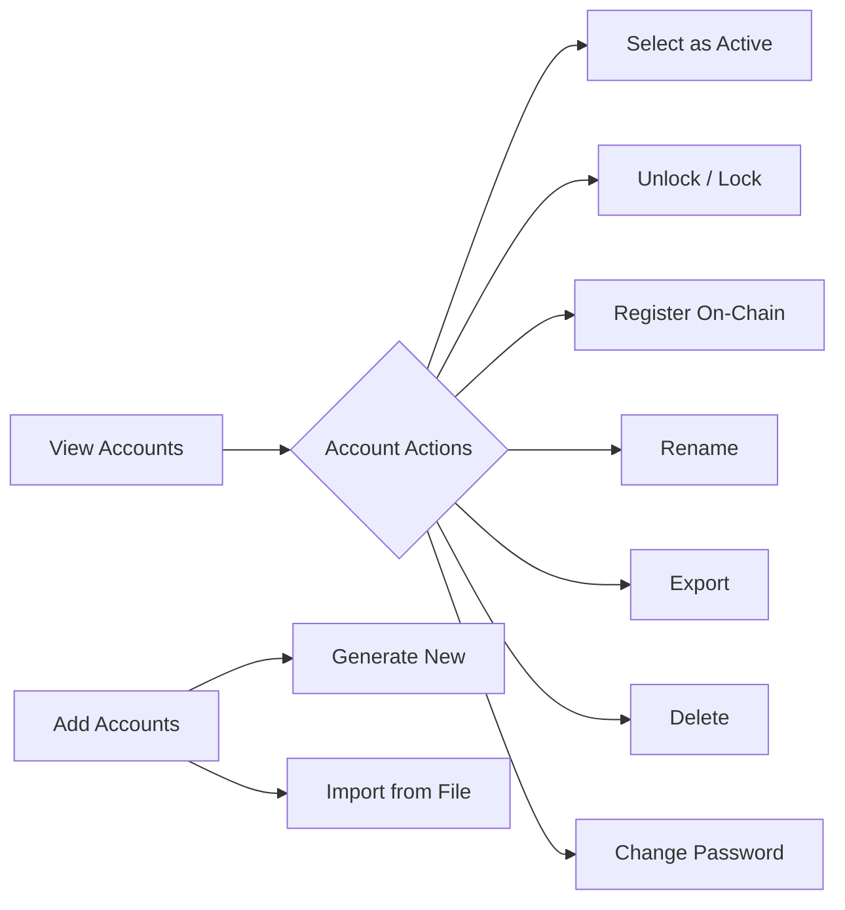
```mermaid
flowchart LR
    A[View Accounts] --> B{Account Actions}
    B --> C[Select as Active]
    B --> D[Unlock / Lock]
    B --> E[Register On-Chain]
    B --> F[Rename]
    B --> G[Export]
    B --> H[Delete]
    B --> I[Change Password]

    J[Add Accounts] --> K[Generate New]
    J --> L[Import from File]
```

### Generate Confidential Account Flow

> 📋 See [Account Generation Sequence](#account-generation-sequence) for detailed steps.

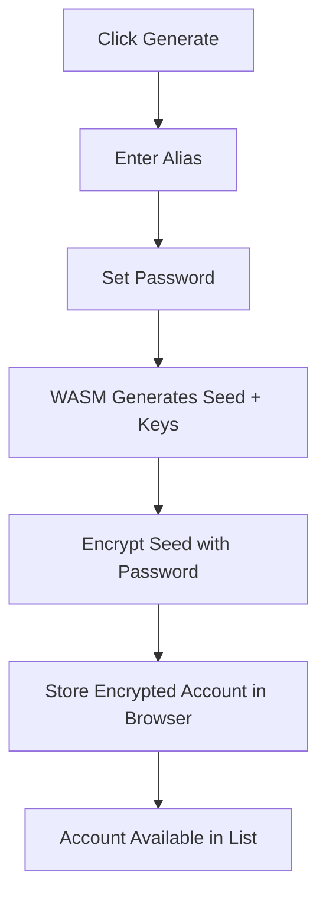
```mermaid
flowchart TD
    A[Click Generate] --> B[Enter Alias]
    B --> C[Set Password]
    C --> D[WASM Generates Seed + Keys]
    D --> E[Encrypt Seed with Password]
    E --> F[Store Encrypted Account in Browser]
    F --> G[Account Available in List]
```

### Unlock Account Flow

Confidential accounts are stored encrypted in the browser. They must be unlocked before performing cryptographic operations.

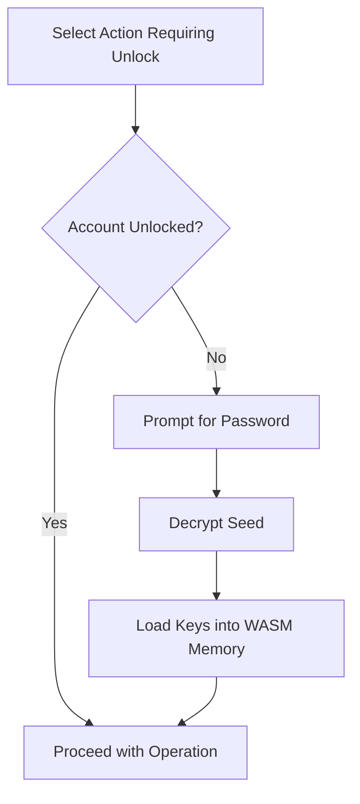
```mermaid
flowchart TD
    A[Select Action Requiring Unlock] --> B{Account Unlocked?}
    B -->|Yes| C[Proceed with Operation]
    B -->|No| D[Prompt for Password]
    D --> E[Decrypt Seed]
    E --> F[Load Keys into WASM Memory]
    F --> C
```

### Account Registration Flow

Registering a confidential account links your public keys to your DID on-chain. This is required before you can register for assets or participate in settlements.

> 📋 See [Account Registration Sequence](#account-registration-sequence) for detailed steps.

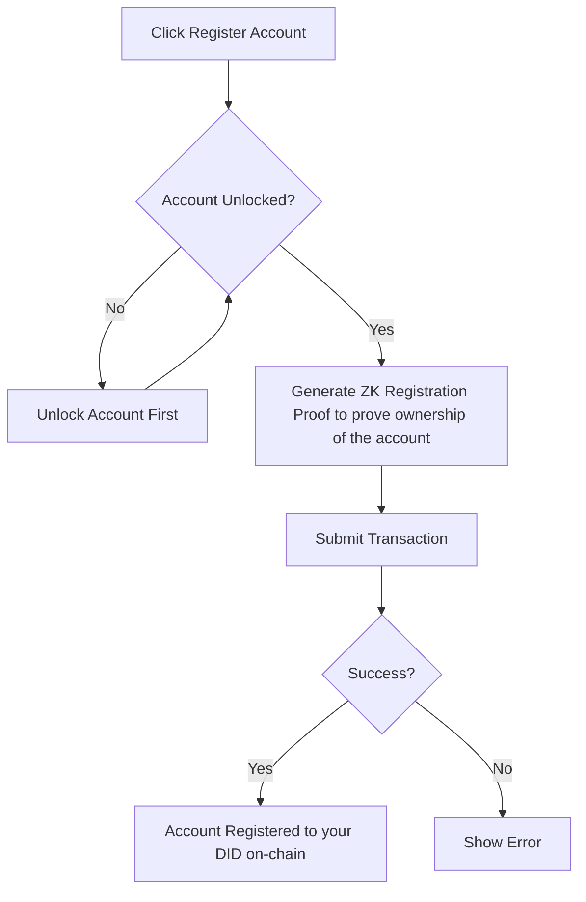
```mermaid
flowchart TD
    A[Click Register Account] --> B{Account Unlocked?}
    B -->|No| C[Unlock Account First]
    C --> B
    B -->|Yes| D[Generate ZK Registration Proof to prove ownership of the account]
    D --> E[Submit Transaction]
    E --> F{Success?}
    F -->|Yes| G[Account Registered to your DID on-chain]
    F -->|No| H[Show Error]
```

### Import Account Flow

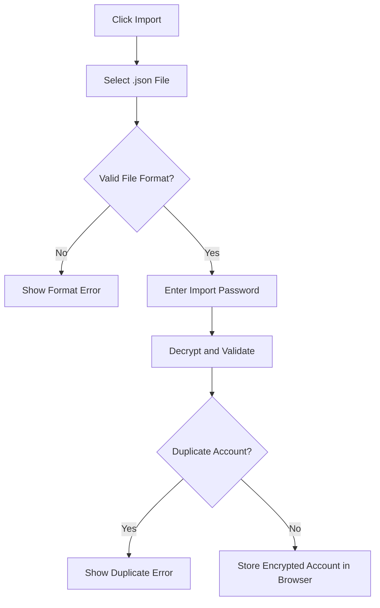
```mermaid
flowchart TD
    A[Click Import] --> B[Select .json File]
    B --> C{Valid File Format?}
    C -->|No| D[Show Format Error]
    C -->|Yes| E[Enter Import Password]
    E --> F[Decrypt and Validate]
    F --> G{Duplicate Account?}
    G -->|Yes| H[Show Duplicate Error]
    G -->|No| I[Store Encrypted Account in Browser]
```

### Export Account Flow

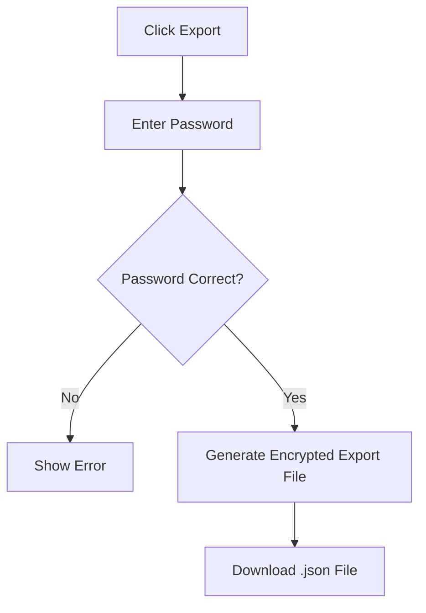
```mermaid
flowchart TD
    A[Click Export] --> B[Enter Password]
    B --> C{Password Correct?}
    C -->|No| D[Show Error]
    C -->|Yes| E[Generate Encrypted Export File]
    E --> F[Download .json File]
```

### Account Generation Sequence

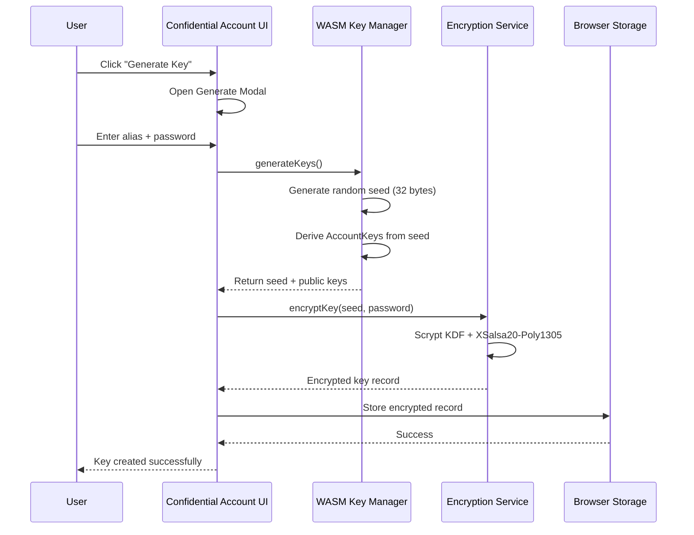
```mermaid
sequenceDiagram
    participant User
    participant UI as Confidential Account UI
    participant WASM as WASM Key Manager
    participant Crypto as Encryption Service
    participant Storage as Browser Storage

    User->>UI: Click "Generate Key"
    UI->>UI: Open Generate Modal
    User->>UI: Enter alias + password
    UI->>WASM: generateKeys()
    WASM->>WASM: Generate random seed (32 bytes)
    WASM->>WASM: Derive AccountKeys from seed
    WASM-->>UI: Return seed + public keys
    UI->>Crypto: encryptKey(seed, password)
    Crypto->>Crypto: Scrypt KDF + XSalsa20-Poly1305
    Crypto-->>UI: Encrypted key record
    UI->>Storage: Store encrypted record
    Storage-->>UI: Success
    UI-->>User: Key created successfully
```

### Account Registration Sequence

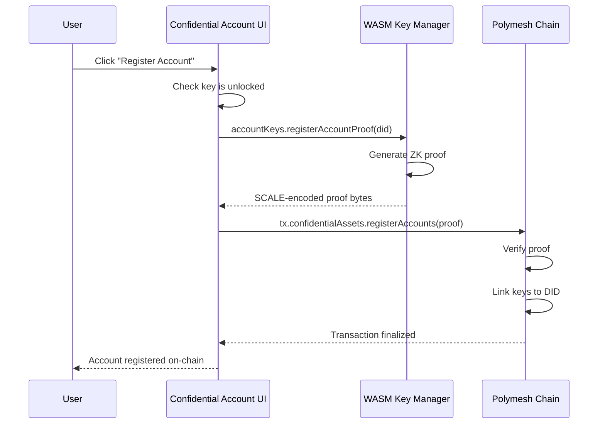
```mermaid
sequenceDiagram
    participant User
    participant UI as Confidential Account UI
    participant WASM as WASM Key Manager
    participant Chain as Polymesh Chain

    User->>UI: Click "Register Account"
    UI->>UI: Check key is unlocked
    UI->>WASM: accountKeys.registerAccountProof(did)
    WASM->>WASM: Generate ZK proof
    WASM-->>UI: SCALE-encoded proof bytes
    UI->>Chain: tx.confidentialAssets.registerAccounts(proof)
    Chain->>Chain: Verify proof
    Chain->>Chain: Link keys to DID
    Chain-->>UI: Transaction finalized
    UI-->>User: Account registered on-chain
```

---

## Asset Management

### Available Asset Actions

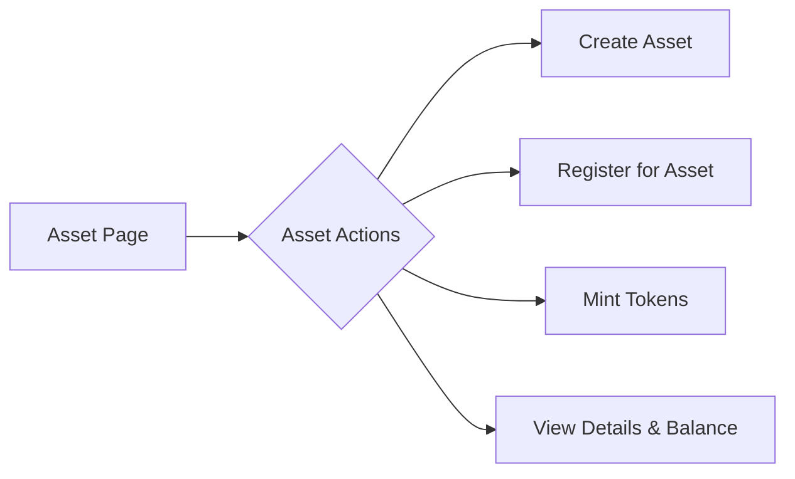
```mermaid
flowchart LR
    A[Asset Page] --> B{Asset Actions}
    B --> C[Create Asset]
    B --> D[Register for Asset]
    B --> E[Mint Tokens]
    B --> F[View Details & Balance]
```

### Create Asset Flow

> 📋 See [Asset Creation Sequence](#asset-creation-sequence) for detailed steps.

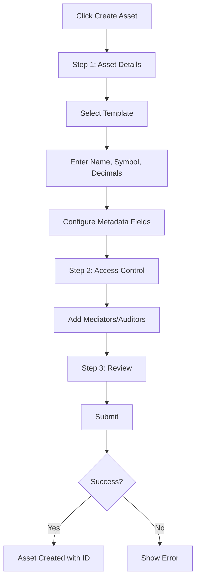
```mermaid
flowchart TD
    A[Click Create Asset] --> B[Step 1: Asset Details]
    B --> C[Select Template]
    C --> D[Enter Name, Symbol, Decimals]
    D --> E[Configure Metadata Fields]
    E --> F[Step 2: Access Control]
    F --> G[Add Mediators/Auditors]
    G --> H[Step 3: Review]
    H --> I[Submit]
    I --> J{Success?}
    J -->|Yes| K[Asset Created with ID]
    J -->|No| L[Show Error]
```

### Register for Asset Flow

You must register your confidential account for an asset before you can hold or transfer it. This step initializes your confidential account balance to zero for this asset.

> 📋 See [Register for Asset Sequence](#register-for-asset-sequence) for detailed steps.

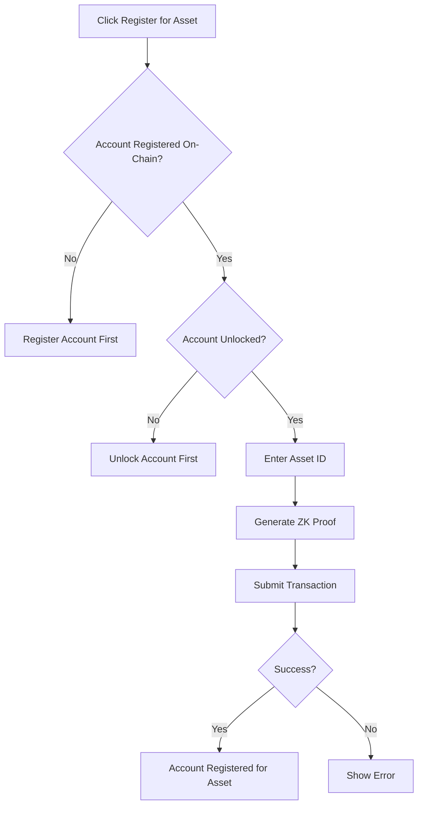
```mermaid
flowchart TD
    A[Click Register for Asset] --> B{Account Registered On-Chain?}
    B -->|No| C[Register Account First]
    B -->|Yes| D{Account Unlocked?}
    D -->|No| E[Unlock Account First]
    D -->|Yes| F[Enter Asset ID]
    F --> G[Generate ZK Proof]
    G --> H[Submit Transaction]
    H --> I{Success?}
    I -->|Yes| J[Account Registered for Asset]
    I -->|No| K[Show Error]
```

### Mint Tokens Flow

Only the asset issuer can mint tokens to their registered confidential account.

> 📋 See [Mint Tokens Sequence](#mint-tokens-sequence) for detailed steps.

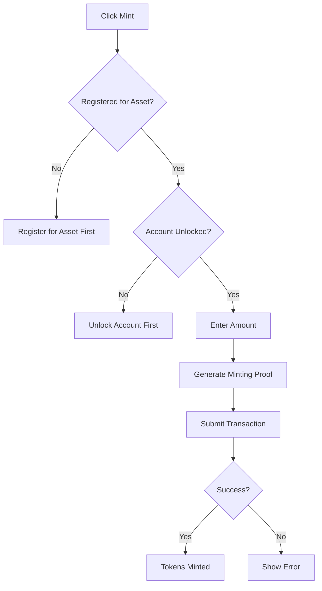
```mermaid
flowchart TD
    A[Click Mint] --> B{Registered for Asset?}
    B -->|No| C[Register for Asset First]
    B -->|Yes| D{Account Unlocked?}
    D -->|No| E[Unlock Account First]
    D -->|Yes| F[Enter Amount]
    F --> G[Generate Minting Proof]
    G --> H[Submit Transaction]
    H --> I{Success?}
    I -->|Yes| J[Tokens Minted]
    I -->|No| K[Show Error]
```

### Asset Creation Sequence

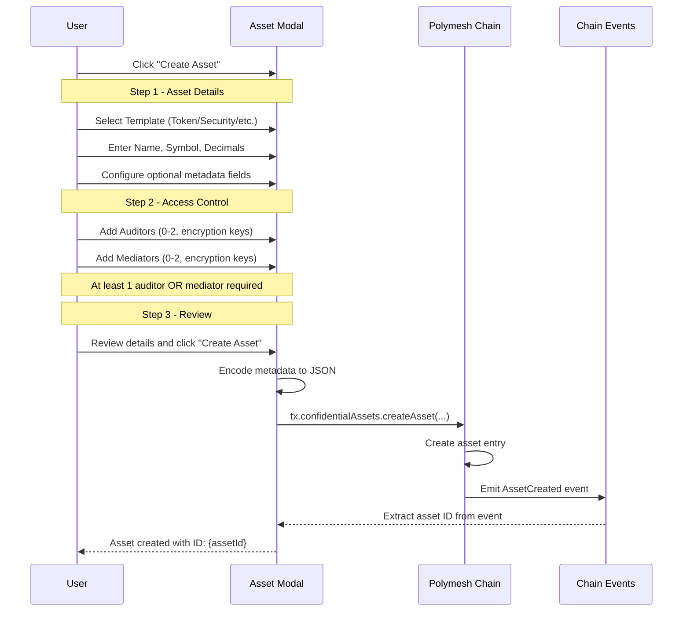
```mermaid
sequenceDiagram
    participant User
    participant UI as Asset Modal
    participant Chain as Polymesh Chain
    participant Events as Chain Events

    User->>UI: Click "Create Asset"

    Note over User,UI: Step 1 - Asset Details
    User->>UI: Select Template (Token/Security/etc.)
    User->>UI: Enter Name, Symbol, Decimals
    User->>UI: Configure optional metadata fields

    Note over User,UI: Step 2 - Access Control
    User->>UI: Add Auditors (0-2, encryption keys)
    User->>UI: Add Mediators (0-2, encryption keys)
    Note over User,UI: At least 1 auditor OR mediator required

    Note over User,UI: Step 3 - Review
    User->>UI: Review details and click "Create Asset"

    UI->>UI: Encode metadata to JSON
    UI->>Chain: tx.confidentialAssets.createAsset(...)
    Chain->>Chain: Create asset entry
    Chain->>Events: Emit AssetCreated event
    Events-->>UI: Extract asset ID from event
    UI-->>User: Asset created with ID: {assetId}
```

### Register for Asset Sequence

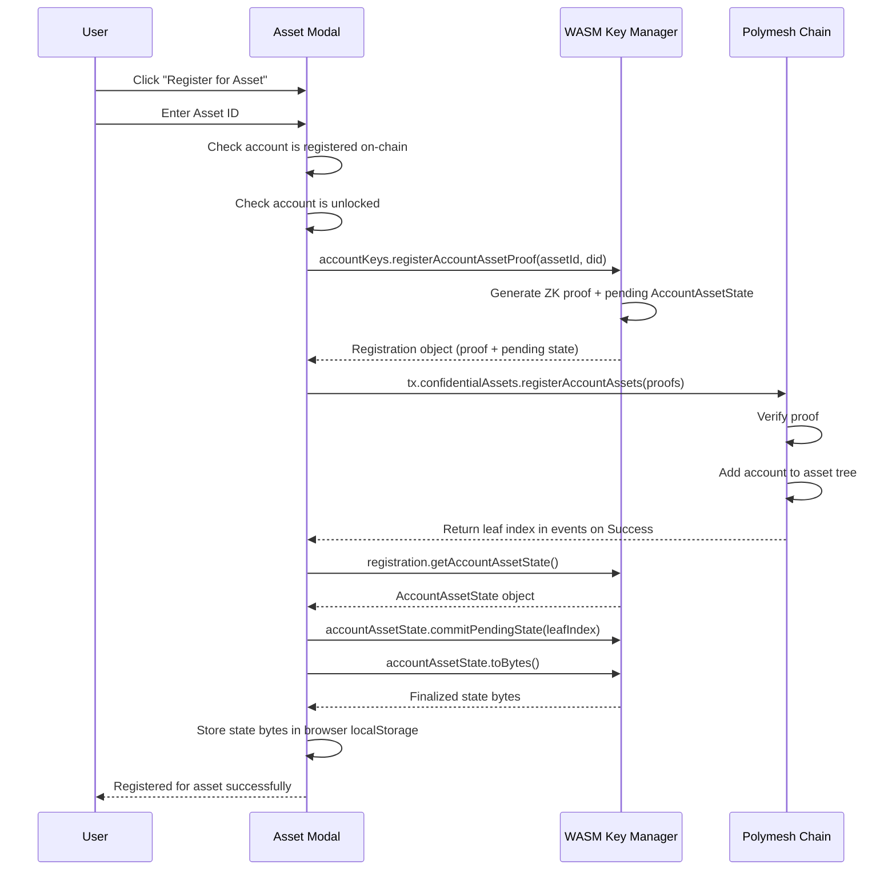
```mermaid
sequenceDiagram
    participant User
    participant UI as Asset Modal
    participant WASM as WASM Key Manager
    participant Chain as Polymesh Chain

    User->>UI: Click "Register for Asset"
    User->>UI: Enter Asset ID
    UI->>UI: Check account is registered on-chain
    UI->>UI: Check account is unlocked
    UI->>WASM: accountKeys.registerAccountAssetProof(assetId, did)
    WASM->>WASM: Generate ZK proof + pending AccountAssetState
    WASM-->>UI: Registration object (proof + pending state)
    UI->>Chain: tx.confidentialAssets.registerAccountAssets(proofs)
    Chain->>Chain: Verify proof
    Chain->>Chain: Add account to asset tree
    Chain-->>UI: Return leaf index in events on Success
    UI->>WASM: registration.getAccountAssetState()
    WASM-->>UI: AccountAssetState object
    UI->>WASM: accountAssetState.commitPendingState(leafIndex)
    UI->>WASM: accountAssetState.toBytes()
    WASM-->>UI: Finalized state bytes
    UI->>UI: Store state bytes in browser localStorage
    UI-->>User: Registered for asset successfully
```

### Mint Tokens Sequence

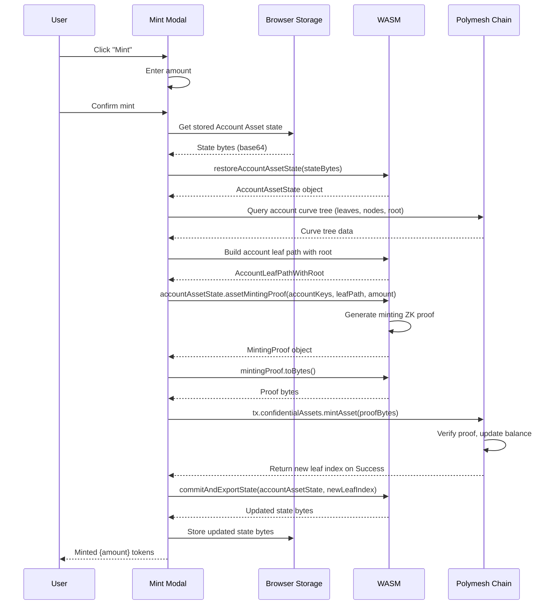
```mermaid
sequenceDiagram
    participant User
    participant UI as Mint Modal
    participant Storage as Browser Storage
    participant WASM as WASM
    participant Chain as Polymesh Chain

    User->>UI: Click "Mint"
    UI->>UI: Enter amount
    User->>UI: Confirm mint
    UI->>Storage: Get stored Account Asset state
    Storage-->>UI: State bytes (base64)
    UI->>WASM: restoreAccountAssetState(stateBytes)
    WASM-->>UI: AccountAssetState object
    UI->>Chain: Query account curve tree (leaves, nodes, root)
    Chain-->>UI: Curve tree data
    UI->>WASM: Build account leaf path with root
    WASM-->>UI: AccountLeafPathWithRoot
    UI->>WASM: accountAssetState.assetMintingProof(accountKeys, leafPath, amount)
    WASM->>WASM: Generate minting ZK proof
    WASM-->>UI: MintingProof object
    UI->>WASM: mintingProof.toBytes()
    WASM-->>UI: Proof bytes
    UI->>Chain: tx.confidentialAssets.mintAsset(proofBytes)
    Chain->>Chain: Verify proof, update balance
    Chain-->>UI: Return new leaf index on Success
    UI->>WASM: commitAndExportState(accountAssetState, newLeafIndex)
    WASM-->>UI: Updated state bytes
    UI->>Storage: Store updated state bytes
    UI-->>User: Minted {amount} tokens
```

---

## Settlement Workflows

Confidential transfers use multi-party settlement instructions that require affirmations from all parties.

> [!IMPORTANT]
> **Key Settlement Mechanics:**
>
> - When the **sender affirms**, their balance is **immediately deducted** (funds are locked)
> - Only **mediators can reject** a settlement
> - If a sender has already affirmed, they can **revert to reclaim** their locked assets

### Settlement Lifecycle

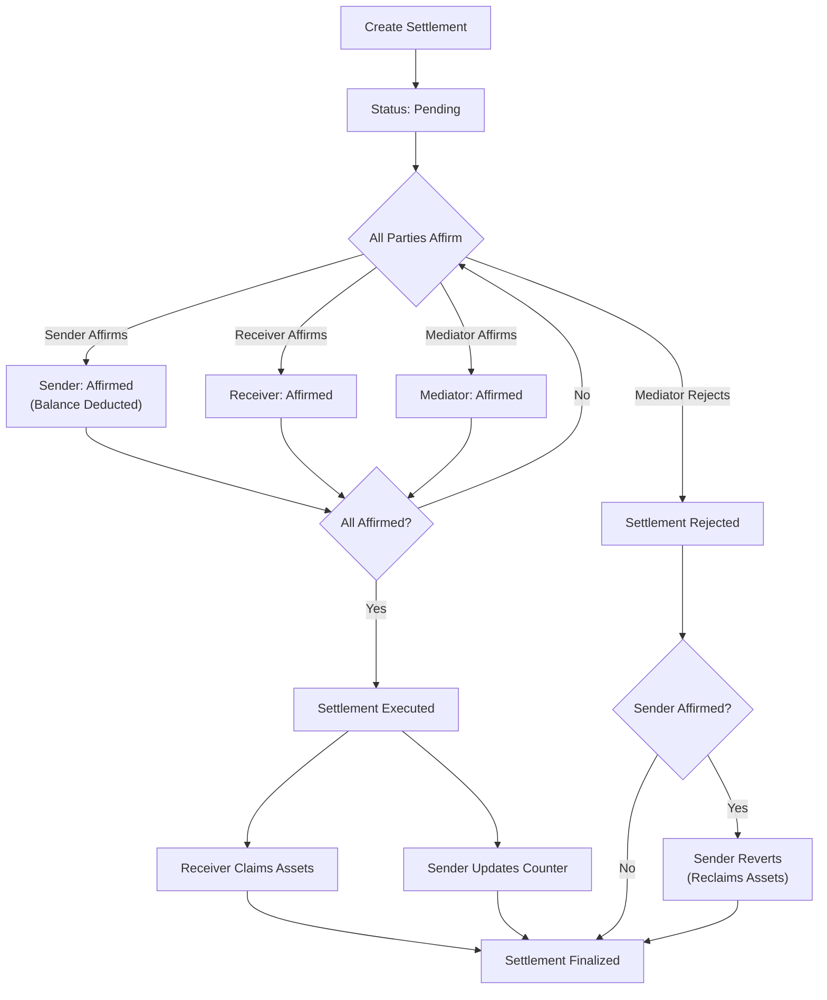
```mermaid
flowchart TD
    A[Create Settlement] --> B[Status: Pending]
    B --> C{All Parties Affirm}
    C -->|Sender Affirms| D["Sender: Affirmed<br/>(Balance Deducted)"]
    C -->|Receiver Affirms| E[Receiver: Affirmed]
    C -->|Mediator Affirms| F[Mediator: Affirmed]

    D & E & F --> G{All Affirmed?}
    G -->|No| C
    G -->|Yes| H[Settlement Executed]

    H --> I[Receiver Claims Assets]
    H --> J[Sender Updates Counter]

    I & J --> K[Settlement Finalized]

    C -->|Mediator Rejects| L[Settlement Rejected]
    L --> M{Sender Affirmed?}
    M -->|No| K
    M -->|Yes| N["Sender Reverts<br/>(Reclaims Assets)"]
    N --> K
```

### Create Settlement Flow

> 📋 See [Create Settlement Sequence](#create-settlement-sequence) for detailed steps.

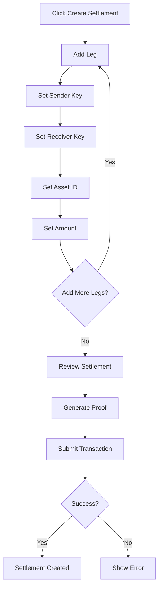
```mermaid
flowchart TD
    A[Click Create Settlement] --> B[Add Leg]
    B --> C[Set Sender Key]
    C --> D[Set Receiver Key]
    D --> E[Set Asset ID]
    E --> F[Set Amount]
    F --> G{Add More Legs?}
    G -->|Yes| B
    G -->|No| H[Review Settlement]
    H --> I[Generate Proof]
    I --> J[Submit Transaction]
    J --> K{Success?}
    K -->|Yes| L[Settlement Created]
    K -->|No| M[Show Error]
```

### Settlement Actions by Role

| Role         | Available Actions              | Balance Change | Counter Change |
| ------------ | ------------------------------ | -------------- | -------------- |
| **Sender**   | Affirm                         | −Amount        | +1             |
| **Sender**   | Revert (after affirming)       | +Amount        | −1             |
| **Sender**   | Update Counter (after execute) | —              | −1             |
| **Receiver** | Affirm                         | —              | +1             |
| **Receiver** | Claim Assets (after execute)   | +Amount        | −1             |
| **Mediator** | Affirm or Reject               | —              | —              |

> [!NOTE]
> **Counter Mechanics for Proof of Balance**
>
> The counter tracks pending settlements and is essential for generating Proof of Balance (proving you haven't hidden funds). Unlike pure private UTXOs where users can "forget" coins, this counter ensures full balance accountability.
>
> - **Affirming** increases counter (+1) — settlement is pending
> - **Claim/Revert/Counter Update** decreases counter (−1) — settlement resolved
> - Lower counters make Proof of Balance cheaper (fewer legs in ZK proof)
> - Once all parties finalize (receiver claims, sender updates counter), the chain can prune settlement details

### Create Settlement Sequence

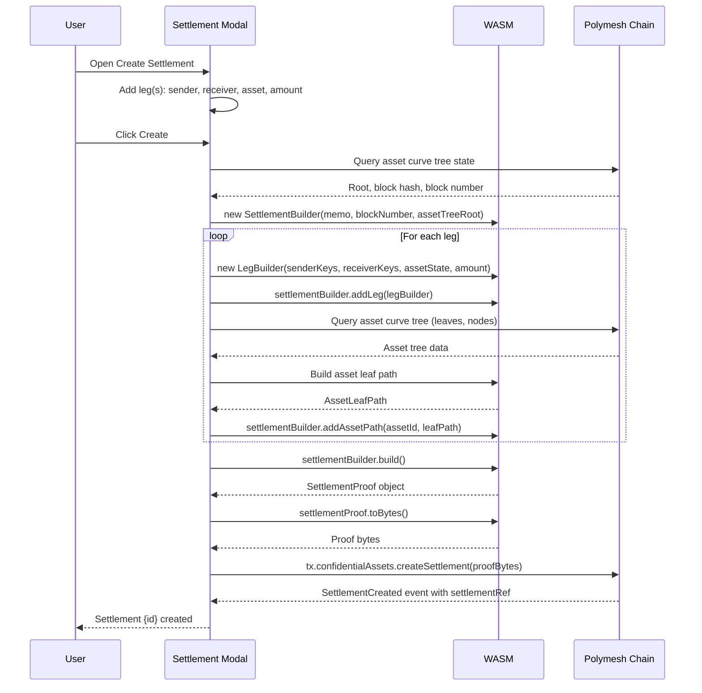
```mermaid
sequenceDiagram
    participant User
    participant UI as Settlement Modal
    participant WASM as WASM
    participant Chain as Polymesh Chain

    User->>UI: Open Create Settlement
    UI->>UI: Add leg(s): sender, receiver, asset, amount
    User->>UI: Click Create

    UI->>Chain: Query asset curve tree state
    Chain-->>UI: Root, block hash, block number
    UI->>WASM: new SettlementBuilder(memo, blockNumber, assetTreeRoot)

    loop For each leg
        UI->>WASM: new LegBuilder(senderKeys, receiverKeys, assetState, amount)
        UI->>WASM: settlementBuilder.addLeg(legBuilder)
        UI->>Chain: Query asset curve tree (leaves, nodes)
        Chain-->>UI: Asset tree data
        UI->>WASM: Build asset leaf path
        WASM-->>UI: AssetLeafPath
        UI->>WASM: settlementBuilder.addAssetPath(assetId, leafPath)
    end

    UI->>WASM: settlementBuilder.build()
    WASM-->>UI: SettlementProof object
    UI->>WASM: settlementProof.toBytes()
    WASM-->>UI: Proof bytes
    UI->>Chain: tx.confidentialAssets.createSettlement(proofBytes)
    Chain-->>UI: SettlementCreated event with settlementRef
    UI-->>User: Settlement {id} created
```

### View/Decrypt Settlement Flow

After a settlement is created, other parties must look up and decrypt it to view the transfer details and take action.

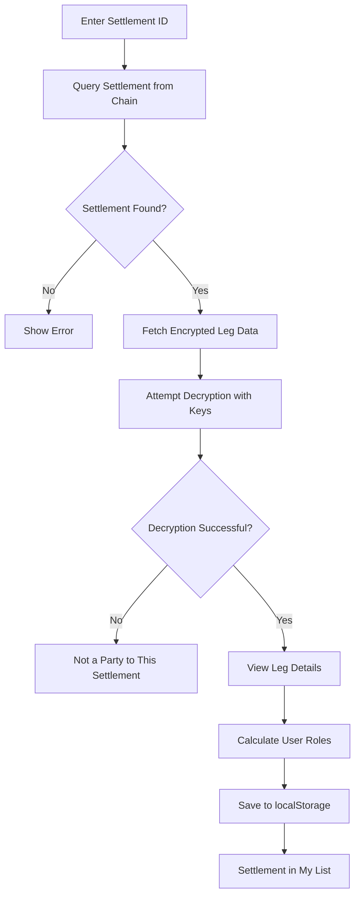
```mermaid
flowchart TD
    A[Enter Settlement ID] --> B[Query Settlement from Chain]
    B --> C{Settlement Found?}
    C -->|No| D[Show Error]
    C -->|Yes| E[Fetch Encrypted Leg Data]
    E --> F[Attempt Decryption with Keys]
    F --> G{Decryption Successful?}
    G -->|No| H["Not a Party to This Settlement"]
    G -->|Yes| I[View Leg Details]
    I --> J[Calculate User Roles]
    J --> K[Save to localStorage]
    K --> L[Settlement in My List]
```

### Decrypt Settlement Sequence

```mermaid
sequenceDiagram
    participant User
    participant UI as Settlement Page
    participant Storage as Browser Storage
    participant WASM as WASM
    participant Chain as Polymesh Chain

    User->>UI: Enter Settlement ID
    User->>UI: Click "Lookup Settlement"
    UI->>Chain: Query settlement details
    Chain-->>UI: Settlement metadata (legs count, status)

    loop For each leg
        UI->>Chain: Query encrypted leg data
        Chain-->>UI: EncryptedLeg object
        UI->>WASM: encryptedLeg.tryDecrypt(accountKeys)
        alt Sender/Receiver decryption succeeds
            WASM-->>UI: DecryptedLeg (sender, receiver, asset, amount)
        else Try as Mediator/Auditor
            UI->>WASM: accountKeys.encryptionKeyPair()
            WASM-->>UI: EncryptionKeyPair
            UI->>WASM: encryptedLeg.tryDecryptAsMediatorOrAuditor(encryptionKeyPair)
            WASM-->>UI: DecryptedLeg or null
        end
    end

    alt User is a party to the settlement
        UI->>UI: Calculate roles (sender/receiver/mediator/auditor)
        UI->>Storage: Save settlement record with roles
        UI-->>User: Show decrypted settlement details
        Note over User,Storage: Settlement now saved for quick access
    else User is not involved
        UI-->>User: Error - Not a party to this settlement
    end
```

> [!NOTE]
> Once decrypted, settlement details are saved to localStorage for convenience. Users can then access their settlements from "My Settlements" list without re-entering the ID.

### Sender Affirmation Sequence

```mermaid
sequenceDiagram
    participant User
    participant UI as Settlement Details
    participant Storage as Browser Storage
    participant WASM as WASM
    participant Chain as Polymesh Chain

    User->>UI: Click "Affirm as Sender"
    UI->>Storage: Get stored Account Asset state
    Storage-->>UI: State bytes (base64)
    UI->>WASM: restoreAccountAssetState(stateBytes)
    WASM-->>UI: AccountAssetState object
    UI->>Chain: Query encrypted leg data
    Chain-->>UI: EncryptedLeg object
    UI->>Chain: Query account curve tree (leaves, nodes, root)
    Chain-->>UI: Curve tree data
    UI->>WASM: Build account leaf path with root
    WASM-->>UI: AccountLeafPathWithRoot
    UI->>WASM: accountAssetState.senderAffirmProof(accountKeys, leafPath, settlementId, legId, encryptedLeg, assetId, amount)
    WASM->>WASM: Generate sender affirmation proof
    WASM-->>UI: AffirmationProof object
    UI->>WASM: affirmationProof.toBytes()
    WASM-->>UI: Proof bytes
    UI->>Chain: tx.confidentialAssets.senderAffirmation(proofBytes)
    Chain->>Chain: Verify proof, update affirmation status
    Chain->>Chain: Deduct balance, increment counter
    Chain-->>UI: Return new leaf index on Success
    UI->>WASM: commitAndExportState(accountAssetState, newLeafIndex)
    WASM-->>UI: Updated state bytes
    UI->>Storage: Store updated state bytes
    UI-->>User: Affirmed as sender
```

### Receiver Affirmation Sequence

```mermaid
sequenceDiagram
    participant User
    participant UI as Settlement Details
    participant Storage as Browser Storage
    participant WASM as WASM
    participant Chain as Polymesh Chain

    User->>UI: Click "Affirm as Receiver"
    UI->>Storage: Get stored Account Asset state
    Storage-->>UI: State bytes (base64)
    UI->>WASM: restoreAccountAssetState(stateBytes)
    WASM-->>UI: AccountAssetState object
    UI->>Chain: Query encrypted leg data
    Chain-->>UI: EncryptedLeg object
    UI->>Chain: Query account curve tree (leaves, nodes, root)
    Chain-->>UI: Curve tree data
    UI->>WASM: Build account leaf path with root
    WASM-->>UI: AccountLeafPathWithRoot
    UI->>WASM: accountAssetState.receiverAffirmProof(accountKeys, leafPath, settlementId, legId, encryptedLeg, assetId, amount)
    WASM->>WASM: Generate receiver affirmation proof
    WASM-->>UI: AffirmationProof object
    UI->>WASM: affirmationProof.toBytes()
    WASM-->>UI: Proof bytes
    UI->>Chain: tx.confidentialAssets.receiverAffirmation(proofBytes)
    Chain->>Chain: Verify proof, update affirmation status
    Chain->>Chain: Increment counter (no balance change)
    Chain-->>UI: Return new leaf index on Success
    UI->>WASM: commitAndExportState(accountAssetState, newLeafIndex)
    WASM-->>UI: Updated state bytes
    UI->>Storage: Store updated state bytes
    UI-->>User: Affirmed as receiver
```

### Mediator Affirmation Sequence

Mediators use only the encryption key pair and don't maintain account asset state.

```mermaid
sequenceDiagram
    participant User
    participant UI as Settlement Details
    participant WASM as WASM
    participant Chain as Polymesh Chain

    User->>UI: Click "Affirm" or "Reject" as Mediator
    UI->>Chain: Query encrypted leg data
    Chain-->>UI: EncryptedLeg object
    UI->>WASM: accountKeys.encryptionKeyPair()
    WASM-->>UI: EncryptionKeyPair
    UI->>WASM: encryptionKeyPair.mediatorAffirmationProof(settlementId, legId, encryptedLeg, accept, assetId, amount)
    Note over UI,WASM: accept=true for affirm, accept=false for reject
    WASM->>WASM: Generate mediator affirmation proof
    WASM-->>UI: AffirmationProof object
    UI->>WASM: affirmationProof.toBytes()
    WASM-->>UI: Proof bytes
    UI->>Chain: tx.confidentialAssets.mediatorAffirmation(proofBytes)
    alt Affirm (accept=true)
        Chain->>Chain: Verify proof, mark mediator as affirmed
    else Reject (accept=false)
        Chain->>Chain: Verify proof, reject settlement
    end
    Chain-->>UI: Transaction finalized
    UI-->>User: Mediator action complete
```

### Receiver Claim Sequence

After settlement execution, the receiver must claim to credit assets to their balance.

```mermaid
sequenceDiagram
    participant User
    participant UI as Settlement Details
    participant Storage as Browser Storage
    participant WASM as WASM
    participant Chain as Polymesh Chain

    Note over User,Chain: After settlement is executed
    User->>UI: Click "Claim Assets"
    UI->>Storage: Get stored Account Asset state
    Storage-->>UI: State bytes (base64)
    UI->>WASM: restoreAccountAssetState(stateBytes)
    WASM-->>UI: AccountAssetState object
    UI->>Chain: Query encrypted leg data
    Chain-->>UI: EncryptedLeg object
    UI->>Chain: Query account curve tree (leaves, nodes, root)
    Chain-->>UI: Curve tree data
    UI->>WASM: Build account leaf path with root
    WASM-->>UI: AccountLeafPathWithRoot
    UI->>WASM: accountAssetState.receiverClaimProof(accountKeys, leafPath, settlementId, legId, encryptedLeg, assetId, amount)
    WASM->>WASM: Generate claim proof
    WASM-->>UI: ClaimProof object
    UI->>WASM: claimProof.toBytes()
    WASM-->>UI: Proof bytes
    UI->>Chain: tx.confidentialAssets.receiverClaim(proofBytes)
    Chain->>Chain: Verify proof
    Chain->>Chain: Credit balance, decrement counter
    Chain-->>UI: Return new leaf index on Success
    UI->>WASM: commitAndExportState(accountAssetState, newLeafIndex)
    WASM-->>UI: Updated state bytes
    UI->>Storage: Store updated state bytes
    UI-->>User: Assets claimed
```

### Sender Counter Update Sequence

After settlement execution, the sender can update their counter. This doesn't change their balance but decreases the counter, making future Proof of Balance operations cheaper.

```mermaid
sequenceDiagram
    participant User
    participant UI as Settlement Details
    participant Storage as Browser Storage
    participant WASM as WASM
    participant Chain as Polymesh Chain

    Note over User,Chain: After settlement is executed
    User->>UI: Click "Update Counter"
    UI->>Storage: Get stored Account Asset state
    Storage-->>UI: State bytes (base64)
    UI->>WASM: restoreAccountAssetState(stateBytes)
    WASM-->>UI: AccountAssetState object
    UI->>Chain: Query encrypted leg data
    Chain-->>UI: EncryptedLeg object
    UI->>Chain: Query account curve tree (leaves, nodes, root)
    Chain-->>UI: Curve tree data
    UI->>WASM: Build account leaf path with root
    WASM-->>UI: AccountLeafPathWithRoot
    UI->>WASM: accountAssetState.senderCounterUpdateProof(accountKeys, leafPath, settlementId, legId, encryptedLeg, assetId, amount)
    WASM->>WASM: Generate counter update proof
    WASM-->>UI: CounterUpdateProof object
    UI->>WASM: counterUpdateProof.toBytes()
    WASM-->>UI: Proof bytes
    UI->>Chain: tx.confidentialAssets.senderUpdateCounter(proofBytes)
    Chain->>Chain: Verify proof
    Chain->>Chain: Decrement counter (no balance change)
    Chain-->>UI: Return new leaf index on Success
    UI->>WASM: commitAndExportState(accountAssetState, newLeafIndex)
    WASM-->>UI: Updated state bytes
    UI->>Storage: Store updated state bytes
    UI-->>User: Counter updated
```

### Sender Revert Sequence

After a transfer has been rejected, the sender can revert their affirmation to reclaim their locked assets.

```mermaid
sequenceDiagram
    participant User
    participant UI as Settlement Details
    participant Storage as Browser Storage
    participant WASM as WASM
    participant Chain as Polymesh Chain

    Note over User,Chain: Sender can revert to reclaim locked assets
    User->>UI: Click "Revert Affirmation"
    UI->>Storage: Get stored Account Asset state
    Storage-->>UI: State bytes (base64)
    UI->>WASM: restoreAccountAssetState(stateBytes)
    WASM-->>UI: AccountAssetState object
    UI->>Chain: Query encrypted leg data
    Chain-->>UI: EncryptedLeg object
    UI->>Chain: Query account curve tree (leaves, nodes, root)
    Chain-->>UI: Curve tree data
    UI->>WASM: Build account leaf path with root
    WASM-->>UI: AccountLeafPathWithRoot
    UI->>WASM: accountAssetState.senderRevertProof(accountKeys, leafPath, settlementId, legId, encryptedLeg, assetId, amount)
    WASM->>WASM: Generate revert proof
    WASM-->>UI: RevertProof object
    UI->>WASM: revertProof.toBytes()
    WASM-->>UI: Proof bytes
    UI->>Chain: tx.confidentialAssets.senderRevert(proofBytes)
    Chain->>Chain: Verify proof, reject settlement
    Chain->>Chain: Restore balance, decrement counter
    Chain-->>UI: Return new leaf index on Success
    UI->>WASM: commitAndExportState(accountAssetState, newLeafIndex)
    WASM-->>UI: Updated state bytes
    UI->>Storage: Store updated state bytes
    UI-->>User: Settlement rejected - assets reclaimed
```
